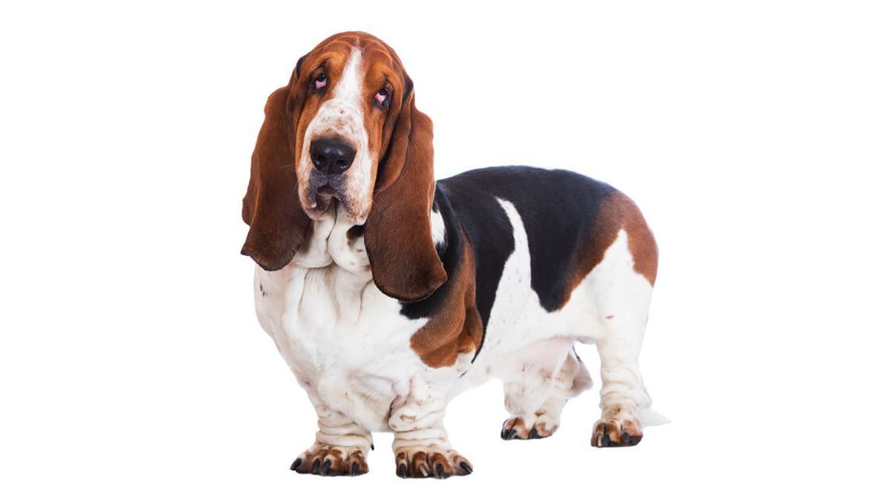

<!-- Example for normal text -->
This is sample text.  
This is second sample.  
<!-- Example for title -->
Markdown testing
================
<!-- Here comes the TOC -->

<!-- Example of paragraph of text -->
It's a beautiful morning, ah  
I think I'll go outside for a while  
And just smile  
Just take in some clean fresh air, boy  
No sense in staying inside  
If the weather's fine and you've got the time  
It's your chance to wake up and plan another brand new day  
Either way
<!-- Example of another paragraph -->
It's a beautiful morning, ah  
Each bird keeps singing his own song  
So long  
I've got to be on my way now  
No fun just hanging around  
I got to cover ground  
You couldn't keep me down
It just ain't no good if the sun shines  
When you're still inside  
Shouldn't hide  
Still inside  
Shouldn't hide  
Still inside, shouldn't hide.  
Oh, oh, oh
<!-- Example for Bold -->
This is **bold** text.
<!-- Example for Italic  -->
This is *italic* text.
<!-- Example for Links -->
[Link](https://www.onet.pl/)  
[Pogoda](http://meteo.pl)
<!-- Example for Images -->


<!-- Example for linking to another file-->

<!-- Example for Headers -->
# **Psy**
Oto rasy psów:
## **Psy myśliwskie**
Psy myśliwskie dzieli się na liczne, mniejsze grupy.
### *Bassety*

Basset to uparty **pies myśliwski**, ale zarazem przyjazny członek rodziny. Pomimo krótkich nóg potrafi poruszać się bardzo szybko. 
<!-- Just text with equation -->

<!-- Example for inline code -->

<!-- A block of code -->
```javascript
function test() {
console.log("look ma`, no spaces");
}
```
<!-- Example for Quote -->
As Kanye West said:
> We're living the future so
> the present is our past.
<!-- Example for Bullet List -->
* Item 1
* Item 2
* Item 2a
* Item 2b
<!-- Example for Numbered List -->
1. German Shepherd  
2. Belgian Shepherd  
2.1. Malinois  
2.2. Groenendael  
2.3. Tervuren  

<!-- Example for Tables -->
Psy myśliwskie | Psy obronne
------------ | -------------
Basset hound | Owczarek niemiecki
Ogar polski | Doberman
<!-- Paragraph after table -->
W tabeli powyżej pokazano różne rasy psów.